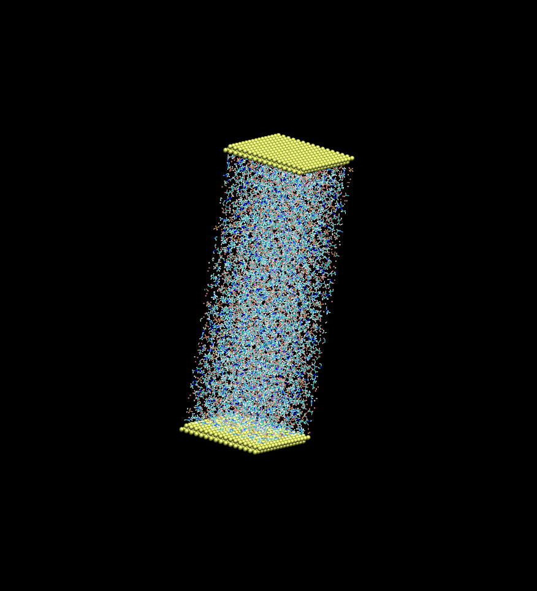
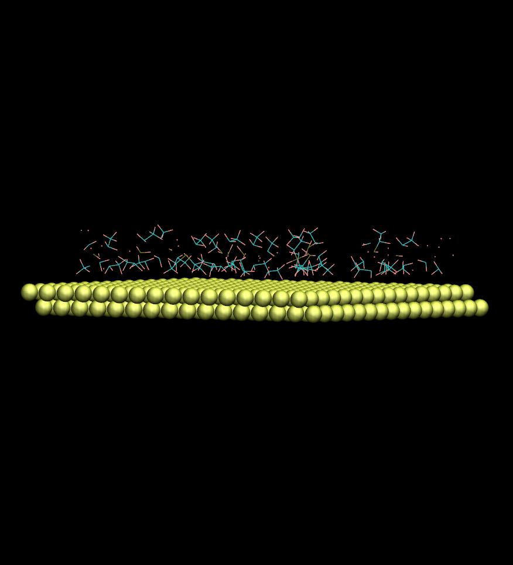

# Project 4 of the Computational Chemistry Couurse

## Authors: João Mendes

### Adsorved Ions

##### [This](https://github.com/LucasEspargueta/QC2023/blob/main/Proj4/main.py) small piece of code  will give you the particles that are adsorved in a surface. For that, the user has to provide a .gro file (an [example](https://github.com/LucasEspargueta/QC2023/blob/main/Proj4/Cell_FAP50_12.00_0.gro) is available), the molecules that are to be studied along with their central atoms, then a surface name must be provided along with the distance for the adsorption criteria. The output will be a .gro file with the adsorved particles and the surface.

&nbsp;

### Input file showing the system to be studied

&nbsp;

### Output file showing the adsorved molecules and the surface

Note: If you are running this code in a Windows machine, you'll probably need to convert the .gro files (both input and output) to a Unix format so it can be visualized in VMD. I recommend using [dos2unix](https://dos2unix.sourceforge.io/) for that, it requires no installation and it's very easy to use.